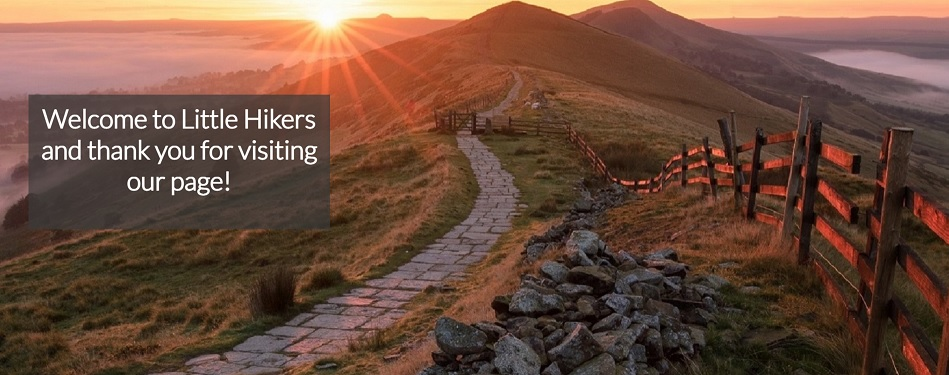
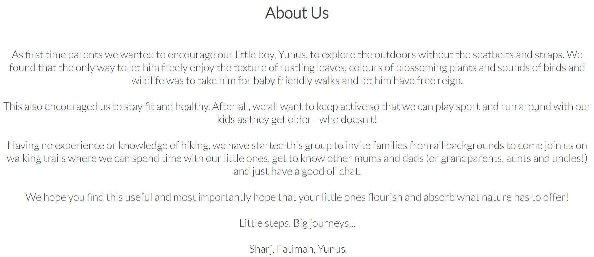
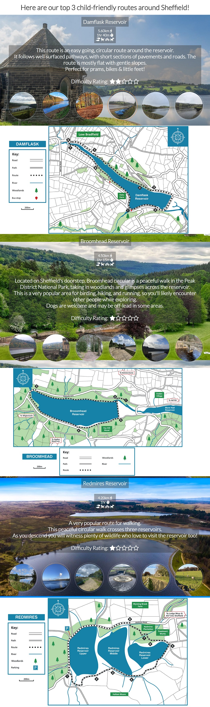
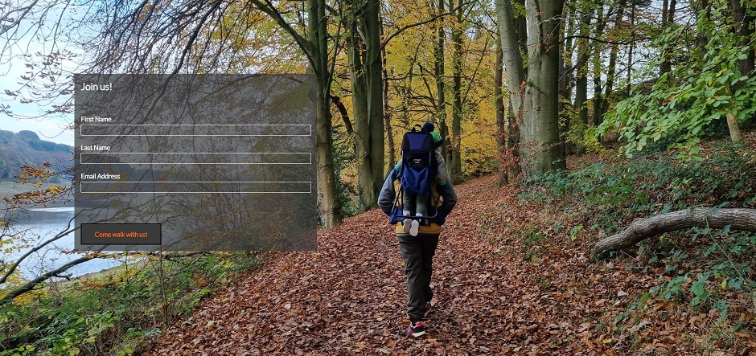
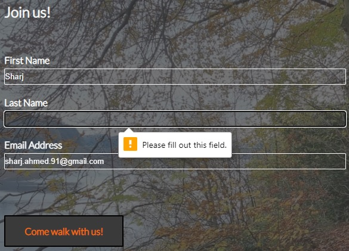
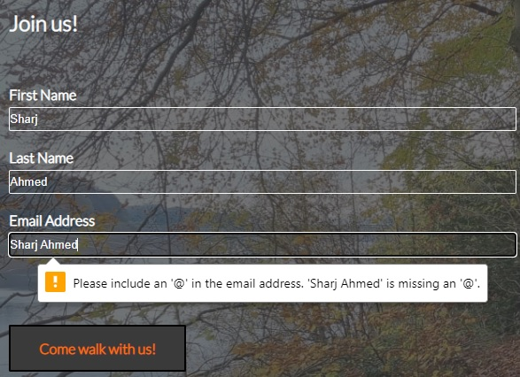

# Little Hikers
Little Hikers is a  simple wesbite designed to help people around Sheffield find some good walking routes to take their children on. 

It is designed to help parents who wish to start taking their children to walking routes around the Sheffield area. 

It provides a list of 3 popular routes that are perfect for young families, and a sign up page if people wish to join the group's mailing list.

## Table of contents
* [Features](#features)
* [Technologies](#technologies)
* [Testing](#testing)
* [Roadblocks and difficulties](#roadblocks-and-difficulties)
* [Bugs](#bugs)
* [Validator Testing](#validator-testing)
* [Citations](#citations)

## Features
* Navigation bar
    - Fixed to top of the site and shows on all pages.
    - Features the Little Hikers logo on the top left.
    - Clearly shows links to all pages on the right: Home, Our Favourite Routes and Sign Up - which all link to the relevant page when clicked on.
    - Banner is a slight off-white and the black text stands out and is clearly readable.
    - Page links, when hovered over, turn orange - a theme that is consistant throughout the site. 

* Main Image 
    - Main image features a relevant image of a pathway in the Peak District with some white welcome text over a slight transparent black background to make it easily readable.  

* About Us
    - A welcoming paragraph explaining the background of why Little Hikers was created. 
    - Kept black text on white background to keep homepage nice and simple.

* Our Favourite Routes
    - This page is designed to show visitors 3 routes that are a good starting point if they wish to start walking with their families.
    - Parralex scrolling effect has been used to show each route, with a background image behind text.
    - Info key included between route header and description which shows:
        - Distance of route
        - Rough time taken to walk route
        - Icon key which shows who the route is suibtable for:
            - Walking
            - Prams
            - Bicycles
            - Dogs
    - Text describes the route, with main features, a low-down explination of what to expect when walking the route and a difficulty rating.
    - Easy level routes chosen to keep in theme of website of walking routes for families with yung children.
    - Below description text is an image gallery set out in a grid row, with a circle border - each image is clickable and full size image opens in a new tab.
    - Borders highlight orange when image is hovered over to keep in theme of the site. 
    - Below each description section is a "buffer" section which includes a map of the route which shows the layout and terrain of each route.

* Sign Up
    - Simple sign up page which a form placed over a background image.
    - Form follows site theme of white text over semi-transparent black background.
    - Submit button also follows the black and orange theme of the site.
    - Colours invert when hovering over submit button. 
    - Form field are formatted correctly and error when incorrect formatting is used or if there are any blank fields.

## Technologies
Project is created with:
* html
* css

## Testing
* I tested in Chrome, Firefox & Edge and confirm it is working in all 3
* I confirm that the pages are responsive and functions correctly on all standard screen sizes using devtools
* I confirm that all text on the site is easily readable and easy to understand
* I confirm all field in the form on the sign up page work correctly. All items are required and only email addresses are accepted in the email field. 

## Roadblocks and difficulties

* Attempted to add background video to Homepage but did not work out - footer icons did not sit below but showed over video.

## Bugs
- ### Solved bugs
    - ### Icons
        - Icons for Home in header & Twiiter in footer weren't loading correctly
        - Tested my code through W3C HTML checker
        - Showed me that this was because I had put the closing </i> & </a> the wrong way round 
    - ### Styling for smaller screens
        - Menu items were showing in reverse order when I styled as flex-direction: column
        - After researching more about flex-direction, I found that flex-direction: column-reverse can be used to solve this issue.
        - I was not able to make the image gallery items go into columns when styling for a smaller screen
        - After meeting with my mentor, I researched display types and found that grid would be better than flex - this solved the issue as I was able to put items into columns to make the page more user friendly. 
- ### Unfixed bugs
    - No unfixed bugs

## Validator Testing

- ### HTML
    - No errors found when passing through the official W3C validator   
- ### CSS
    - No errors found when passing through the official (Jigsaw) validator  
    
## Citations 

* https://www.w3schools.com/howto/howto_css_parallax.asp - scrolling effect to be used on Favourite Routes page
* https://blog.hubspot.com/website/video-background-css - used to try and understand how background videos work - did not end up using
* https://www.w3schools.com/css/css_rwd_mediaqueries.asp - to help understand media query break points
* https://thecodebeast.com/change-order-of-list-items-via-css/ - to help understand flex-direction 
* Footer code was taken from the CI Love Running Project.
* Images taken from AllTrails
* Maps taken from Yorkshire Water